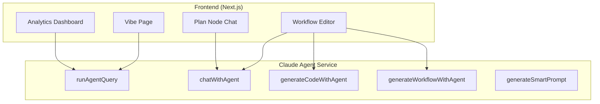

<div align="center">
  
  **Verxio is an AI platform for every workflow automation**
</div>

---

## Overview

Verxio is an autonomous AI-powered workflow automation platform that enables users to create, execute, and manage complex automation workflows through an intuitive visual interface or via an OpenClaw instance (chat gateway)

The platform combines:

- **Visual Workflow Editor**: Drag-and-drop interface for building automation workflows
- **AI Agent Integration**: Claude-powered planning agent for intelligent workflow creation and execution
- **Multi-Platform Integrations**: Support for Telegram, WhatsApp, Google Workspace, Airtable, Stripe, and more
- **Media Generation**: AI-powered image, video, and audio generation using multiple providers
- **Chat Integrations**: AI agents that can interact with users via Telegram and WhatsApp
- **Self-Learning Capabilities**: Workflow learning and optimization based on execution history

---

## Architecture


---

## Test Credential for demo purposes
  - Email: donatusprince@gmail.com
  - Password: 12345678

### Core Features

- **Visual Workflow Editor**
  - Drag-and-drop node-based workflow creation
  - Real-time execution monitoring
  - Workflow templates and generation
  - Code block support (TypeScript, JavaScript, Python, Rust, Anchor)

- **AI-Powered Workflow Generation**
  - Natural language to workflow conversion
  - Intelligent workflow planning and optimization
  - Self-learning from execution history
  - Smart prompt generation

- **Multi-Platform Integrations**
  - **Messaging**: Telegram, WhatsApp, Discord, Slack
  - **Google Workspace**: Sheets, Docs, Slides, Drive, Calendar, Gmail
  - **Data Sources**: Airtable, HTTP APIs
  - **Payment**: Stripe webhooks
  - **Media**: Kling AI (video/image), Veo (video), Remotion (motion graphics)
  - **Composio**: 10,000+ actions across 800+ apps (GitHub, Notion, Jira, HubSpot, ElevenLabs, Firecrawl, and more)

- **Chat Integrations**
  - AI agents via Telegram and WhatsApp
  - Intelligent message processing with Claude planning agent
  - Credit-based usage tracking
  - Private and public chat modes

- **Media Generation**
  - **Images**: Design nodes (Gemini), Kling AI, Design Pro with advanced editing
  - **Videos**: Veo, Kling AI, Remotion for motion graphics
  - **Audio**: Kling TTS (+ ElevenLabs via Composio)

- **Workflow Triggers**
  - Manual triggers
  - Scheduled (cron, interval, daily, weekly, monthly)
  - Webhooks
  - Telegram/WhatsApp message triggers
  - Airtable record changes
  - Stripe events
  - Google Form submissions

- **User Management**
  - Authentication via Better Auth
  - Subscription management (Polar)
  - Credit/quota system
  - API key generation

- **Connections & Credentials**
  - MCP server connections
  - Database connections
  - Documentation sources
  - API endpoint connections
  - Credential management for AI providers

- **Skills System**
  - Custom skills for extending AI capabilities
  - Remotion skills for video generation
  - Document-based skill definitions

---

## API Documentation

When running the backend in development, Swagger documentation is available at:
```
http://localhost:8080/api-docs
```

### Key API Endpoints

#### Workflows
- `GET /api/workflow` - List workflows
- `POST /api/workflow` - Create workflow
- `GET /api/workflow/:id` - Get workflow
- `PUT /api/workflow/:id` - Update workflow
- `DELETE /api/workflow/:id` - Delete workflow
- `POST /api/workflow/:id/execute` - Execute workflow

#### Chat Integrations
- `GET /api/chat-integrations/integrations` - List integrations
- `POST /api/chat-integrations/integrations` - Create integration
- `POST /api/chat-integrations/integrations/:id/whatsapp/connect` - Connect WhatsApp
- `GET /api/chat-integrations/integrations/:id/whatsapp/status` - Get WhatsApp status

#### Credentials
- `GET /api/credential` - List credentials
- `POST /api/credential` - Create credential
- `PUT /api/credential/:id` - Update credential
- `DELETE /api/credential/:id` - Delete credential

#### Connections
- `GET /api/connections` - List connections
- `POST /api/connections` - Create connection
- `GET /api/connections/:id` - Get connection

#### Skills
- `GET /api/skill` - List skills
- `POST /api/skill` - Create skill
- `PUT /api/skill/:id` - Update skill

#### Planning Agent
- `POST /api/planning/chat` - Chat with planning agent
- `POST /api/planning/generate-workflow` - Generate workflow from prompt
