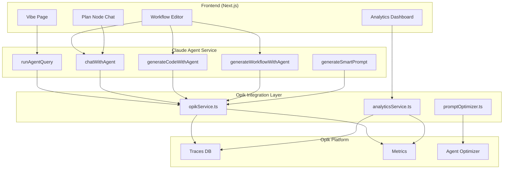

  
  **Verxio is an autonomous self-learning copilot that turns every repeat task into a no-code agentic workflow**

As an AI-powered assistant, Verxio helps you design, run, and manage automated workflows.

---

## Features
TBD
